# System Design

**Stage 1 — Architecture.** Glycol loop → two jobs → part names → how you call heat. Then skim [The Numbers](#the-numbers-that-matter) and the [User’s Guide](#users-guide).

Jump: [Safety](#safety) · [The glycol loop](#locked-architecture) · [The Parts](#the-parts) · [Controls](#controls) · [The Numbers](#the-numbers-that-matter) · [User’s Guide](#users-guide) · [Current Status](#current-status-report) · [Builder’s Guide](#builders-guide)

## Purpose

One closed propylene glycol loop heats cabin air and tap water. The Hydronic D5S sits under the van; the Sure Marine cabin heater, Duda, Isotemp, and Water Flow Tank sit in the cabin. Glycol never mixes with drinking water, never connects to the engine ([DEC-009](#dec-009)), and has no second pump ([DEC-013](#dec-013)).

Leftover heat can sit in the Isotemp static chamber. A planned 750 W / 115 VAC element on Paneltronics **WATER HEATER** can warm that chamber—it does not pump the loop and does not put hot water at the taps by itself.

**Stop and reject** any proposal that would splice into the engine, tee glycol into drinking water, bypass cabin heat, add a second glycol pump, or land the 750 W element on the 12 V panel.

Day-to-day: [User’s Guide](#users-guide). Keep-or-sell: [Isotemp value study](#isotemp-value-study).

## The glycol loop {#locked-architecture}

::: {.media-pair}

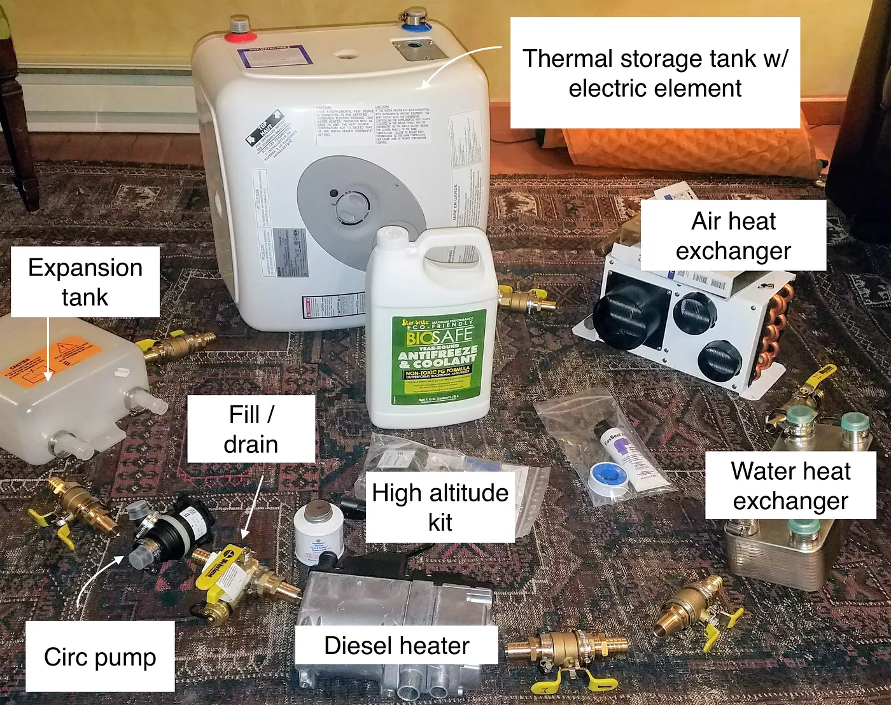
:::

Order only ([DEC-010](#dec-010)):

1. Heater’s own pump → Hydronic D5S  
2. Sure Marine cabin heater — cabin heat first  
3. Duda (glycol) — hottest fluid for sinks (~**80%** of hot-water use)  
4. Isotemp coil — stores leftovers  
5. Return  

Water Flow Tank tees into the **return** at the highest circulating point—not in series, not off the Isotemp coil. Keep it highest; fill/drain at the low point; unrestricted path from that tee back to the pump. Cabin heater: level, bottom-in / top-out, outlet bleeder.

**Where.** Sure Marine under the fridge (SN 16401). Duda under the sink. Isotemp driver-side under the bench (low). Water Flow Tank in the sofa-bed backrest (high). Day panels: outboard → seat back, inboard → seat butt. Sofa/bed: hybrid wood boxes + aluminum Isotemp cradle + light plywood ([DEC-021](#dec-021)).

## The two jobs

### Cabin air

Living-space air across the Sure Marine cabin heater. Two Noctua fans + one dial. Combustion stays outside.

::: {.media-pair}

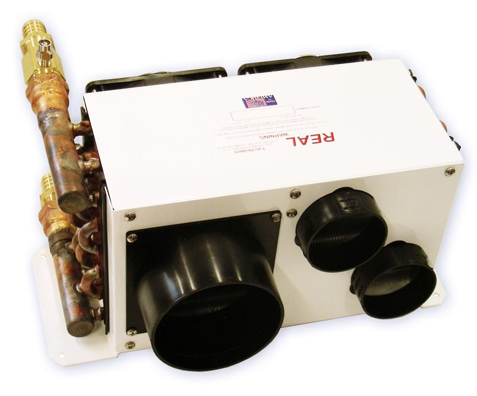
:::

### Tap water

Tank → pump → Duda (cold in bottom, hot out top) → AM100-1LF (~120°F) → taps ([DEC-003](#dec-003) / [DEC-008](#dec-008)). Heat crosses the double wall only. Isotemp chamber is not on this path; factory mixer capped forever.

::: {.media-pair}

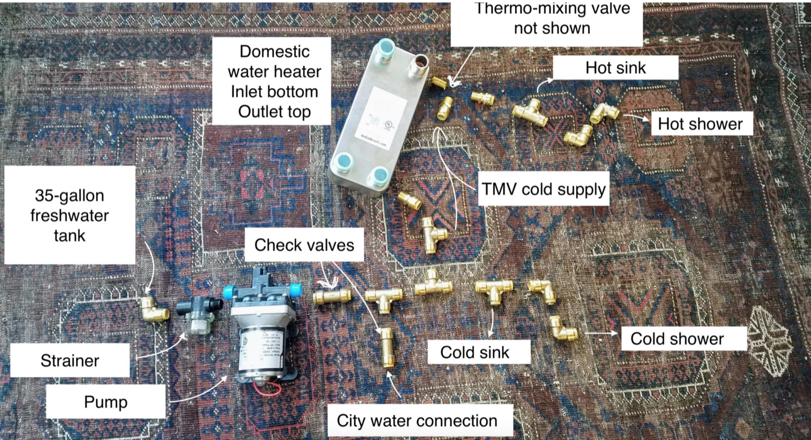
:::

## The Parts {#the-parts}

Meet each part once. After this table, use only these official names or the short forms listed. Do not invent aliases (buffer, Bosch, Espar, “the tank,” “the core,” “the plate”).

| Part (official name) | Photo | Does | Does not |
|---|---|---|---|
| **Hydronic D5S diesel heater** *Short: Hydronic D5S; “the heater” only when unambiguous* | 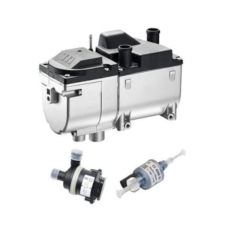{.part-photo} | Burns diesel; own pump moves the loop; stages on coolant temperature ([The Numbers](#the-numbers-that-matter); [SRC-009](#src-009)) | Connect to the engine |
| **Sure Marine cabin heater** *Short: cabin heater* | {.part-photo} | Glycol → cabin air; two fans + one Low/Med/High dial ([DEC-015](#dec-015)); target both Noctua NF-F12 | Pull combustion air into the cabin |
| **Duda B3-12DW-20 plate heat exchanger** *Short: Duda; Duda plate* | 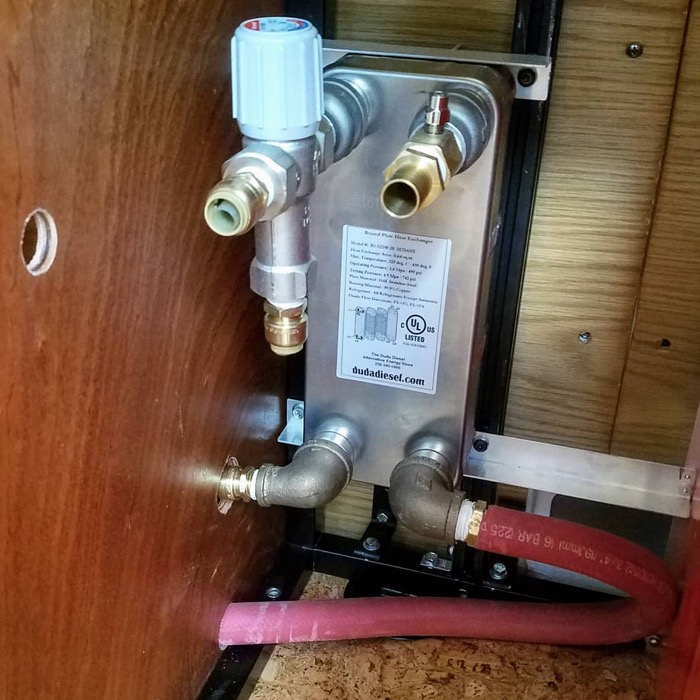{.part-photo} | Glycol → freshwater across a double wall | Mix the two fluids |
| **AM100-1LF thermostatic mixing valve** *Short: AM100-1LF; the mixer* | 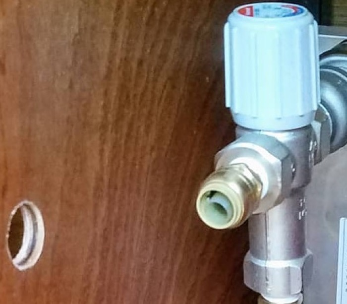{.part-photo} | Limits shower/sink temperature (~120°F) | Connect to a glycol fitting |
| **Isotemp Slim Square 4.2 gal heat battery** *Short: Isotemp; Isotemp coil; Isotemp chamber* | 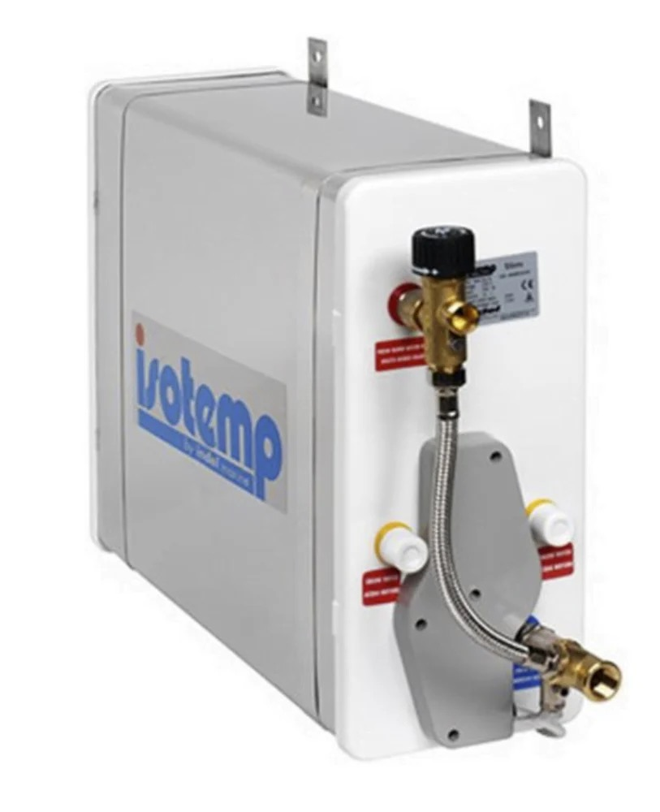{.part-photo} | Softens cycling via coil ↔ static chamber; planned AC on **WATER HEATER**; factory mixer capped forever | Hold drinking water; replace the Duda; circulate glycol with the element; mix taps |
| **Water Flow Tank (WFT) 5 L expansion/header tank** *Short: Water Flow Tank; WFT (brand name, not a cryptic code)* | 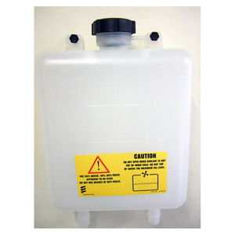{.part-photo} | Expansion + air bleed at the high point (~1.2 bar cap) | Use the Isotemp potable PRV as a glycol setting |
| **EasyStart Timer** *Short: EasyStart* | 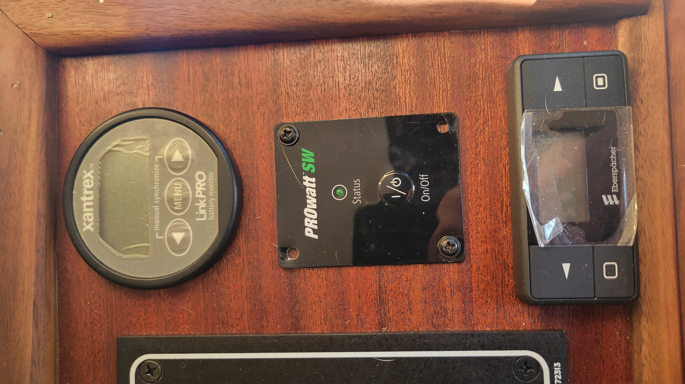{.part-photo} | Schedule / target / start-stop ([SRC-003](#src-003)); bottom unit on the wood panel (under LinkPRO / PROwatt) | Replace the master lockout |
| **Master switch** *Representative Sure Marine W005-378K* | 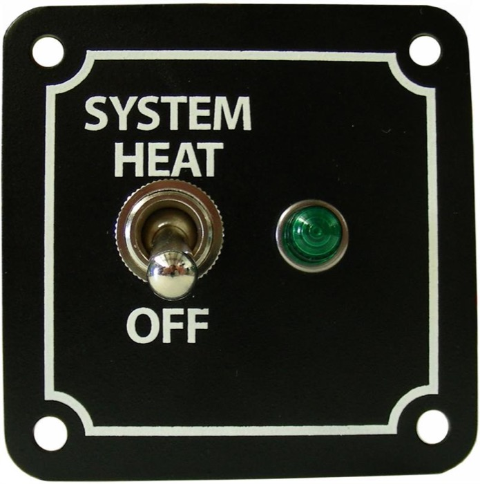{.part-photo} | Off cuts 12 V to EasyStart, SC1600B, and cabin fans ([DEC-012](#dec-012)); garage unit not photographed yet | Control Isotemp AC |
| **SC1600B thermostat** *Short: SC1600B* | 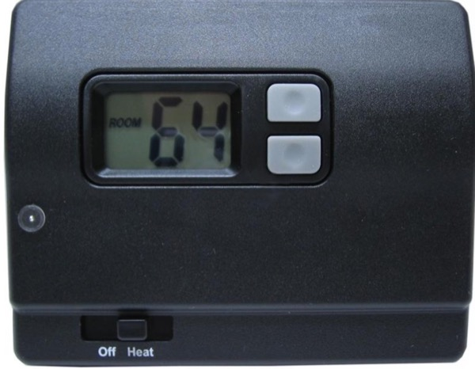{.part-photo} | Heat **signal** only (R–W; no fan output — [SRC-033](#src-033)); needs relay ([Q-022](#q-022)) | Fan power; hot water; trusted auto until landing verified |
| **Noctua NF-F12 PWM fans** *Short: Noctua fans; cabin fans* | 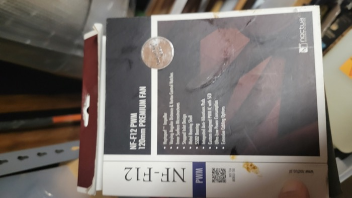{.part-photo} | Move cabin air; power leads only ([DEC-015](#dec-015)) | Heat call |
| **Fan speed controller** *Short: fan dial; book pick Sure Marine W002-912* | 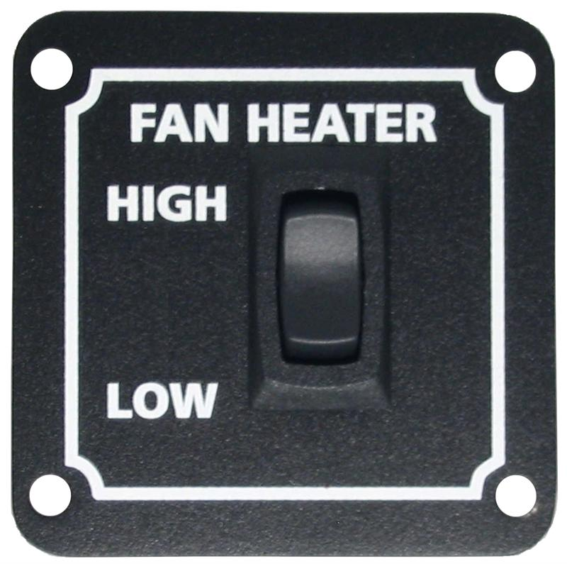{.part-photo} | Low/Med/High **without** hard Off ([DEC-018](#dec-018)) | Off / start the heater |
| **Altitude kit 22 1000 33 22 00** *Short: altitude kit* | 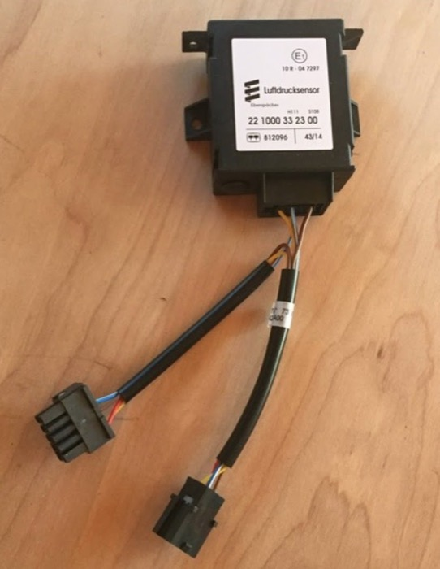{.part-photo} | Cuts fuel delivery at altitude ([SRC-002](#src-002); [DEC-006](#dec-006)) | Replace EasyStart; needed only for high camps |
| **Paneltronics AC panel** *Branch label always **WATER HEATER*** | 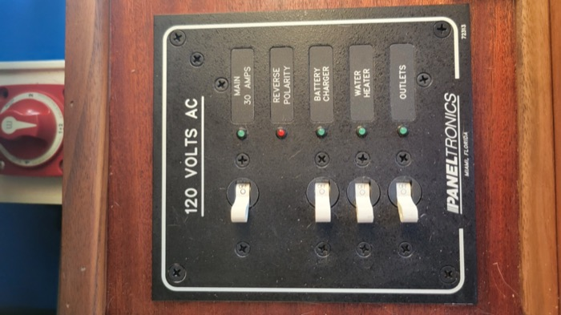{.part-photo} | **WATER HEATER** branch feeds Isotemp 750 W ([DEC-020](#dec-020)) | 12 V heater control |

## Fuel, air, exhaust, and fluids

**Fuel.** Factory aux pickup → metering pump → Hydronic D5S. Prefer pump angle 15°–35°. Keep the line rising; never rest it on the exhaust ([SRC-009](#src-009)). Prime at [HOLD 8](#hold-8-first-fire), then remove the hand bulb. Confirm pump under van before first fire ([Current Status](#current-status-report)).

**Exhaust and combustion air.** Two separate paths to outside; neither enters the cabin. Limits: [The Numbers](#the-numbers-that-matter). Confirm at [HOLD 2](#hold-2-exhaust).



**Glycol.** Loop and Isotemp chamber: ≤50% propylene glycol, **one brand only** ([SRC-009](#src-009); [SRC-029](#src-029) / [SRC-030](#src-030)). Prefer water-first leak check. Never run the pump dry. Freshwater path: [Tap water](#tap-water).

## Controls {#controls}

Two worlds. They never share a fuse panel.

| World | Power | Does | Parked lockout |
|---|---|---|---|
| **12 V** | House battery | Diesel heat call, heater pump, cabin fans | **Master Off** |
| **120 V** | Shore or PROwatt SW → Paneltronics | Isotemp chamber element only | **WATER HEATER** Off |

Master Off stops diesel heat and fans. Master Off does **not** cut Isotemp AC.


**Day-one diesel heat:** Master **On** → EasyStart start → fan dial. Pin tables: [Electrical and Controls](#electrical-and-controls). Still open: [Q-022](#q-022), [Q-009](#q-009); altitude kit at HOLD 4 ([Q-015](#q-015)).

### 12 V — three layers


**Layer 1 — heater always powered.** House battery → **20 A** → **12 AWG** (if round trip ≤ **20 ft / 6 m**) → pins **1** (+) / **2** (−). Not through the master—so the brain can after-run and remember faults.

**Layer 2 — master unlocks controls.** Off/On next to EasyStart; positive only to three branches (Blue Sea ST Blade or a **second breakout** if full):

| Branch | Fuse | Feeds |
|---|---|---|
| A | **5 A** (insert **last**) | EasyStart |
| B | OPEN | Later: thermostat → relay |
| C | OPEN | Fan dial → both Noctuas |

Master On does not start heat—it only unlocks. Parked: master **Off**. Emergency: EasyStart off → master Off → 20 A if needed → battery last. ≤ two off/on into a fault ([SRC-009](#src-009)).

**Layer 3 — wake.**


Branch A → EasyStart pins **1** / **3**. On start, pin **6** (yellow) → heater pin **7** (S+). Heater then runs its water pump (**8–9**), fuel pump (**4** / **10**), and glow / flame. Tape off vehicle-blower pin **3** and kit blower relay.


**Altitude kit** — whole harness adapter (do not snip only yellow). Land at HOLD 4 ([DEC-006](#dec-006)). Required above ~5,000 ft.

**Fans** — Branch C only. Sure Marine [**W002-912**](https://www.suremarineservice.com/Heat/System-Switches/W002-912.html); no Noctua NA-FC1. Speed only—never starts diesel. Until [Q-022](#q-022), fans run whenever master is On and the dial is up.


**Thermostat auto — not ready.** SC1600B R–W is a dry contact; needs a relay for fans ([SRC-019](#src-019)). Do **not** land on EasyStart pins **9–10**. Start heat from EasyStart only until [Q-022](#q-022). Relay notes: [Electrical and Controls](#electrical-and-controls).

### 120 V — Isotemp chamber only

**SmartPlug** *or* **PROwatt SW 2000** → **Blue Sea 9009** (**SHORE** / **INVERTER**) → Paneltronics MAIN → **WATER HEATER** → 750 W element. Label that poorly labelled face ([`photos/ac-electrical.jpg`](../photos/ac-electrical.jpg)). Hardwire GFCI still OPEN ([Q-009](#q-009)). Element warms the **static** chamber only; taps still need the diesel pump through the coil. Route cable at HOLD 4; leave **WATER HEATER** off until [HOLD 9](#hold-9).

**Second 9009** — SmartPlug / **DUOSIDA** J1772 → Mean Well charger only. Not heat.

House inventory and photos: [Working design understanding](#working-design-understanding) · [Electrical and Controls](#electrical-and-controls). Wire sizes here are **AWG** ([SRC-009](#src-009) / [SRC-003](#src-003)).

→ [The Numbers](#the-numbers-that-matter), then the [User’s Guide](#users-guide).
